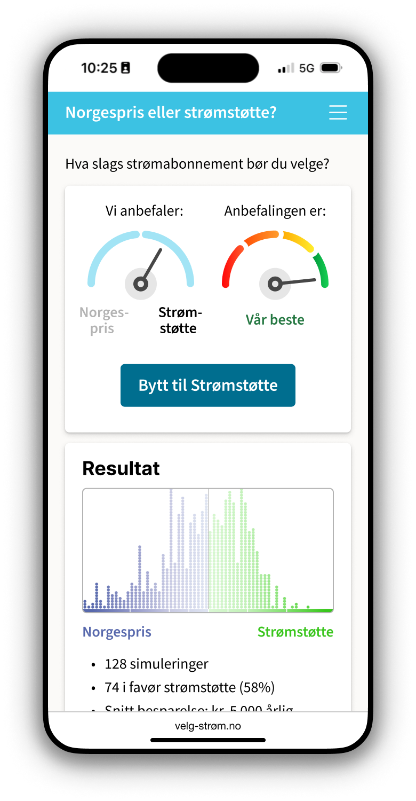

# Concept: «velg-strøm.no: Norgespris eller strømstøtte?»

* Consumer-oriented decision-making tool for selecting the best electricity subscription using [Monte Carlo simulation](https://en.wikipedia.org/wiki/Monte_Carlo_method)
* Provides a recommendation based on historical data, forecasts, and user preferences. Forecasts include future power prices. Optional input from the consumer includes past power consumption.
* Focus on recipient-centric dialogue and the simplest possible interface, as opposed to discussing & visualizing underlying data, which would be sender-centric.

## User experience prototype



* [Desktop friendly demo of mobile app](https://www.figma.com/proto/7sjBbyxgUdYYqbURStYQUW/Hackathon-2025?page-id=0%3A1&node-id=82-6212&viewport=-208%2C149%2C1&t=FuZW9atQ3DwRvP9u-1&scaling=min-zoom&content-scaling=fixed&starting-point-node-id=82%3A6212) (Figma)
* [Mobile demo](https://bit.ly/Krafthack-2025-gruppe-3) (works in a browser, but install Figma on your mobile phone for the best experience) 
* [Video of prototype](https://github.com/krafthack-by-techday/team3/blob/main/team-3-figma-dummy-trim-480p.mov) — 24mb .mov file for download
* [Figma source](https://www.figma.com/design/7sjBbyxgUdYYqbURStYQUW/Hackathon-2025?node-id=82-6212&t=W6iKQOO3H7E135o9-4) — only available to Statkraft employees

## Background for the hackathon

* Statnett hosted a similar hackathon in 2024 that was regarded as a success. Statkraft has also recently had a hackathon, but internal.
* This year’s topic: Credibility crisis in the power industry (“Tillitskrise i kraftbransjen”)
* Agenda: See page 76 in the PDF on SharePoint: [Agenda](https://statnett.sharepoint.com/sites/KraftHackbytechday_fag/Shared%20Documents/Forms/AllItems.aspx?id=%2Fsites%2FKraftHackbytechday%5Ffag%2FShared%20Documents%2FFellesinformasjon%2FOnboardingsm%C3%B8te%2010%2E4%2FInfo%2D%20og%20onboarding%2010%2E04%2E25%2Epdf&parent=%2Fsites%2FKraftHackbytechday%5Ffag%2FShared%20Documents%2FFellesinformasjon%2FOnboardingsm%C3%B8te%2010%2E4)

### Background articles

On the Norwegian population’s trust in the domestic power industry

* [Kraftbransjen har lav tillit](https://www.nrk.no/okonomi/kraftbransjen-har-lav-tillit-1.553773) — nrk.no
* [Innlegg: Kraftbransjens tillitsproblem](https://www.dn.no/innlegg/energi/det-gronne-skiftet/kraftkabler/innlegg-kraftbransjens-tillitsproblem/2-1-1085697) — dn.no
* [Fornybarbransjen sliter med omdømmet](https://www.kime.no/aktuelt/fornybarbransjen-sliter-med-omdommet---blir-vanskeligere-a-gjennomfore-utbygginger-og-investeringer) — kime.no

---

# Technical details

## 🔌 Power Price Optimizer API

A simple FastAPI project that helps users find the **best electricity price model** for their profile in a given year, based on historical data.

### 🚀 Features

- ✅ One simple endpoint
- 📅 Supports year 2023 and 2024
- 👥 Supports two predifined user profiles
- 🧠 Returns the **best price model** for a user/year
- 💰 Displays how much **money or percentage** users can save compared to other models

---

### 📈 Sample Data

The data compares two electricity models for a user profile:
- `strømstøtte`
- `norgespris`

Across years:
- `2023`
- `2024`

Example snippet:
```csv
Modell,Timestamp,Profil A,Profil B
strømstøtte,2023-01-01,4251.38,6955.29
norgespris,2023-01-01,2603.85,4001.15
....
```

## How to run

### 🚀 Install & Setup

```bash
# Install pyenv
curl https://pyenv.run | bash

# Add pyenv to your shell (add to ~/.bashrc or ~/.zshrc)
export PATH="$HOME/.pyenv/bin:$PATH"
eval "$(pyenv init -)"
eval "$(pyenv virtualenv-init -)"

# Install Python and create a virtual environment
pyenv install 3.11.8
pyenv virtualenv 3.11.8 fastapi-env
pyenv local fastapi-env

# Install dependencies
pip install fastapi uvicorn

# Save requirements (optional)
pip freeze > requirements.txt
```
### ▶️ Run Server

```bash
uvicorn main:app --reload
```
